### Project1

* Terraform init is the first command that should be run when setting up a new Terraform project or when working with an existing project for the first time on a new machine.

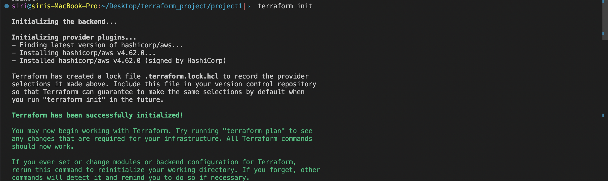

* Terraform plan helpful step to preview the changes that will be made to your infrastructure before actually applying them. This allows you to review the changes and ensure they align with intentions.

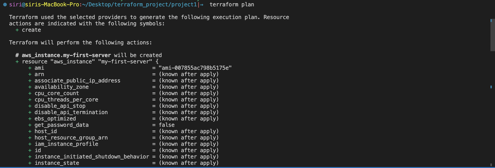

*  Terraform apply is used to create, update, or delete infrastructure resources.

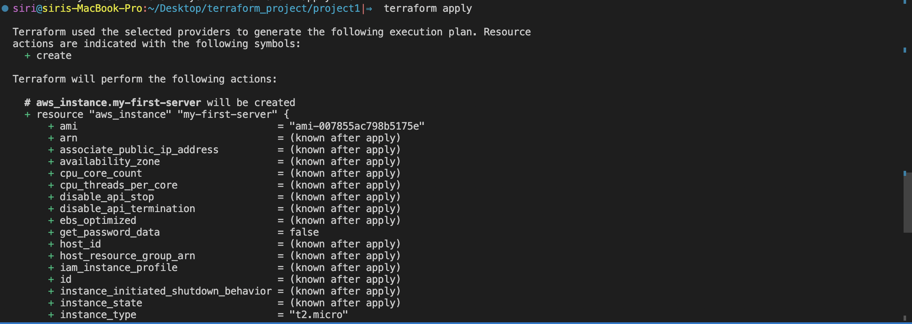

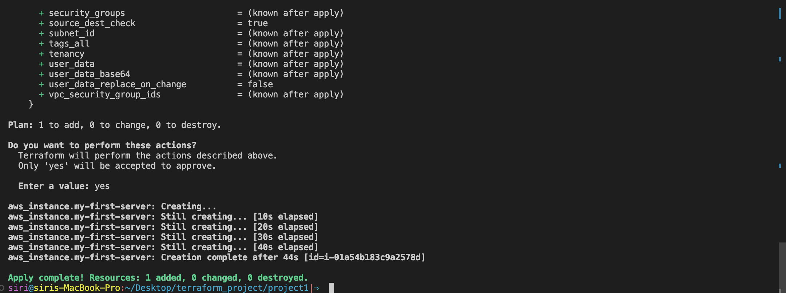

* EC2 using terraform

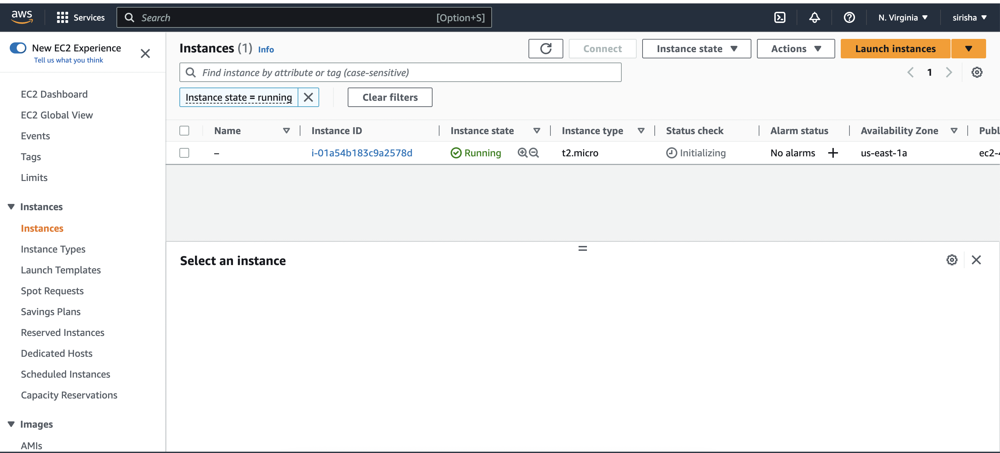

* Subnet using terraform

* VPC using terraform

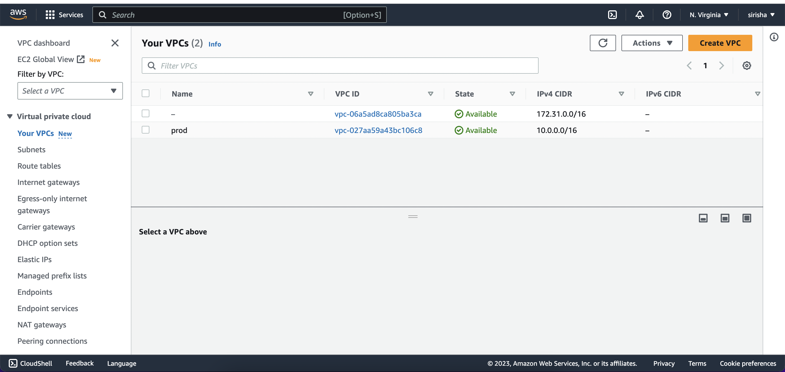

* destroy 

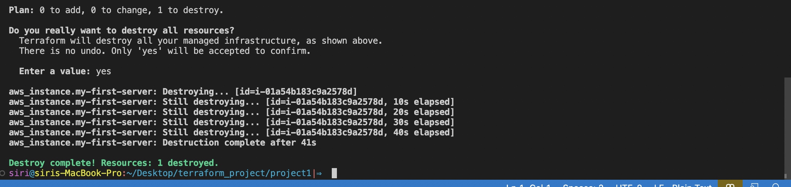

### Project2: Web server running Apache2 within a custom VPC in the AWS account. The server will be accessible from the internet via its Elastic IP address, it allow to serve web content on ports 80 and 443.

Steps: 

1. Configure the AWS Provider: Set up Terraform to communicate with your AWS account using the specified access and secret keys.

2. Create a VPC: Define a virtual private cloud (VPC) with a specified CIDR block to isolate your resources within a virtual network in the AWS cloud.

3. Create an Internet gateway: Attach an Internet gateway to your VPC, enabling instances within the VPC to have direct access to the internet.

4. Create a custom route table: Define a custom route table for your VPC, which determines the routing rules for traffic within the VPC.

5. Create a subnet: Set up a subnet within the VPC with a specific CIDR block and availability zone.

6. Associate the subnet with the route table: Connect the subnet to the custom route table, ensuring that instances in the subnet follow the routing rules defined in the route table.

7. Create a security group: Define a security group with rules that allow inbound traffic on ports 22 (SSH), 80 (HTTP), and 443 (HTTPS).

8. Create a network interface: Set up a network interface with a specific IP address within the subnet created in step 4 and associate it with the security group created in step 7.

9. Assign an Elastic IP to the network interface: Allocate a static, public IP address to the network interface, enabling the instance to be accessible from the internet.

10. Create an Ubuntu server and install/enable Apache2: Launch an EC2 instance running Ubuntu and install the Apache2 web server. Configure the instance to use the network interface with the assigned Elastic IP and security group.

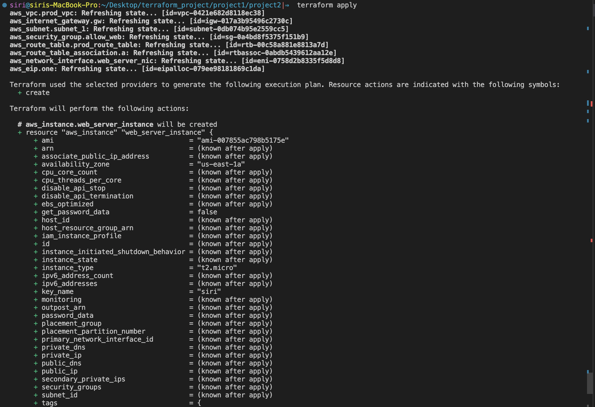

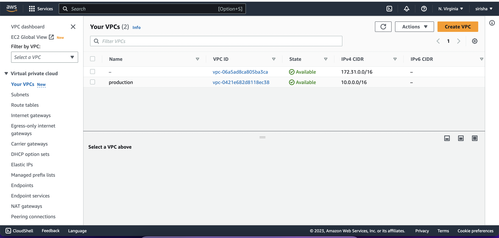

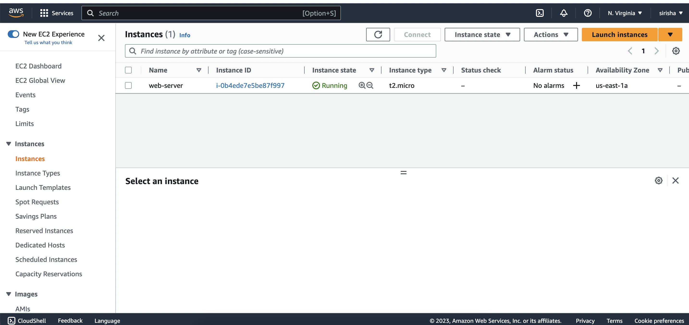

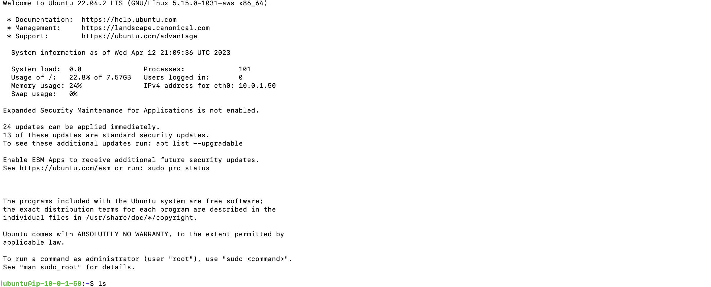

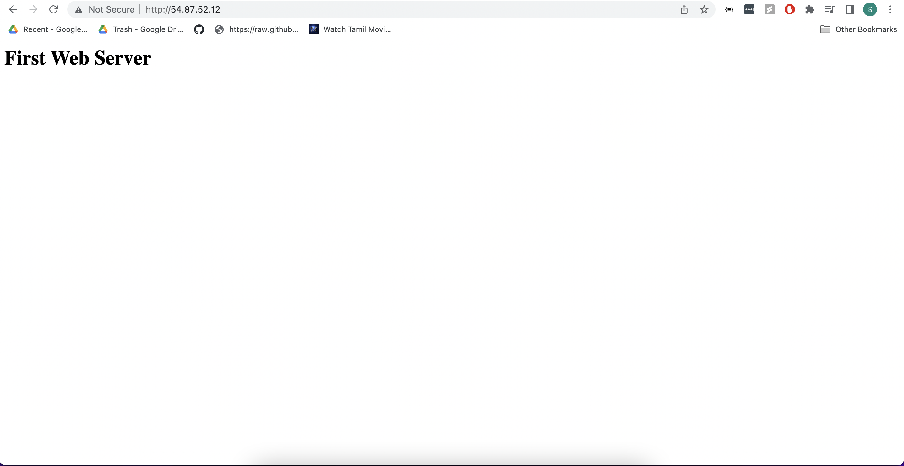

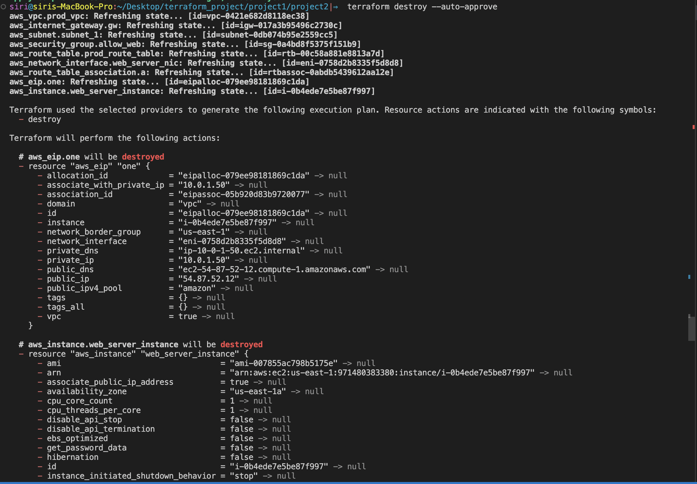

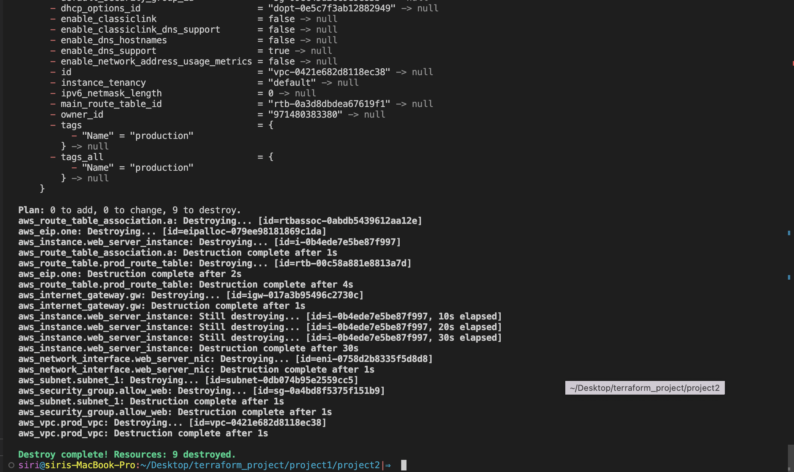

### Terraform state commands

* terraform state list

* terraform state show

